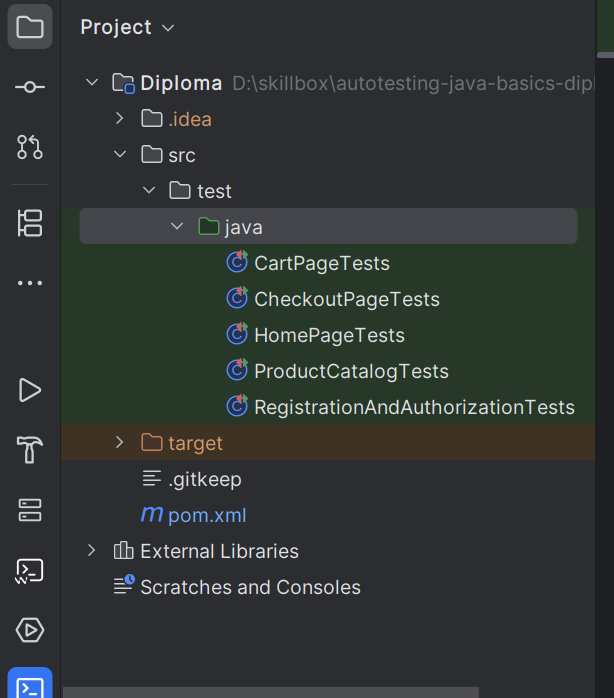
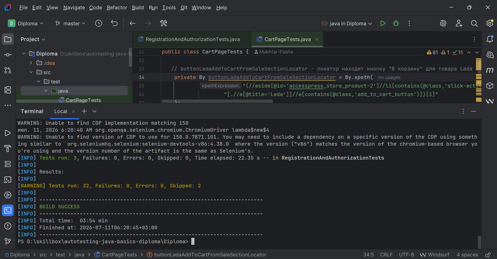

# UI Test Automation for E-commerce Web Application

Automated UI testing project for the main user scenarios of an e-commerce web application.

The project is implemented in **Java** using **Selenium WebDriver**, **JUnit 5** and **Maven** following the **Page Object Model (POM)** approach.

---

## Technologies

- Java
- Selenium WebDriver
- JUnit 5
- Maven
- ChromeDriver (via Selenium Manager)
- IntelliJ IDEA
- Git & GitHub

---

## Tested Application

Test environment:

http://intershop5.skillbox.ru/

> The application is an external testing environment and is not part of this repository.  
> The website structure and test data may change independently of this project.

---

# Project Features

The project automates the main user scenarios of the online store.

Covered functionality includes:

- User registration
- User authorization
- Home page verification
- Product catalog
- Shopping cart
- Checkout process

---

# Project Structure

```
Diploma
│
├── src
│   └── test
│       └── java
│           ├── RegistrationAndAuthorizationTests.java
│           ├── HomePageTests.java
│           ├── ProductCatalogTests.java
│           ├── CartPageTests.java
│           └── CheckoutPageTests.java
│
├── pom.xml
└── README.md
```

---

# Testing Approach

The project demonstrates practical implementation of UI automation testing using:

- Functional Testing
- Regression Testing
- Smoke Testing
- End-to-End Scenarios
- Explicit Waits
- Assertions
- Page Object Model (POM)

---

# Running the Tests

Clone repository

```bash
git clone https://github.com/MukhtarPashaTarkovskiy/autotesting-java-basics-diploma.git
```

Go to project directory

```bash
cd autotesting-java-basics-diploma/Diploma
```

Run tests

```bash
mvn clean test
```

---

# Test Results

The project successfully executes automated UI tests using Maven.

Example output:

```
Tests run: 22
Failures: 0
Errors: 0
Skipped: 2

BUILD SUCCESS
```

---

# Screenshots

## Project Structure



---

## Successful Test Execution



---

# Design Patterns & Best Practices

The project follows several widely used automation testing practices:

- Page Object Model (POM)
- Reusable locators
- Explicit waits
- Readable assertions
- Independent test methods
- Maven project structure

---

# Author

Mukhtar-Pasha Tarkovskiy

Junior QA Automation Engineer

GitHub:

https://github.com/MukhtarPashaTarkovskiy
